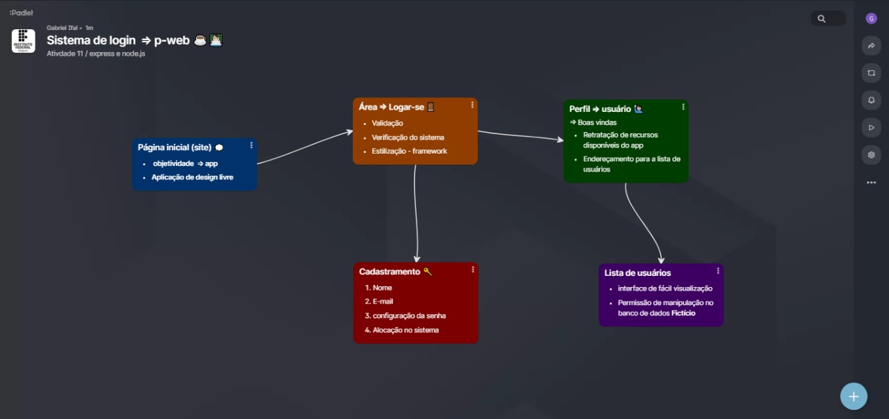

# Sistema de login 🔐
Referente a um projeto passado como atividade 11 , na matéria de pweb 💻☕✨

 Função | Nome | Codenome |
|--------|------|----------|
| Orientador | Leonardo Fernandes | LF|
| Aluno | Gabriel Rodrigues | Ghost |

<table>
  <tr>
    <td></td>
    <td></td>
  </tr>
</table>

 # Mapa de ilustração do funcionamento do projeto 🖼  

#  Análise do projeto  💭🤔

**⚠ Maior problema apresentado durante o desenvolvimento:**
Durante o andamento do projeto na área de perfil do usuário... foi implementado uma rota para a visualização de usuários existentes , com isso nessa parte a lista dessas pessoas teria que propocionar a manipulação do banco (opção de excluir) , em suma , o problema foi referente a atulização de dados após o evento de onclick ao qual uma await estava Interrompendo o funcionamento, entretanto o erro foi resolvido para que houvesse a visualização atual de dados .

---

**Considerações finais: 👍🏻👎🏻**
O projeto solicitado foi uma experiência muito enriquecedora para mim. Apesar dos desafios que enfrentei, eu realmente me envolvi e gostei de aplicar meus conhecimentos de forma prática. Foi gratificante ver como os recursos como o Bootstrap framework e o Express-js podem ser utilizados no desenvolvimento web. No geral, reconheço que este projeto foi uma etapa importante no meu desenvolvimento como desenvolvedor web.🌟👩🏻‍💻🚀

# Referências 📌

 ### Bootstrap framework 

 https://getbootstrap.com/

### Express-js Documention 

https://expressjs.com/
